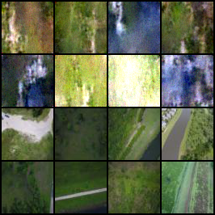
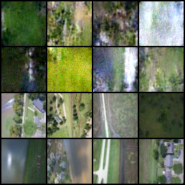
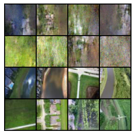

# Task 1

Для обучения диффузионной модели я использую датасет [FloodNet](https://github.com/BinaLab/FloodNet-Supervised_v1.0), часть `train` из 1445 изображений.

Чтобы не приходилось во время обучения модели считывать большие изображения (3000х4000, 5MB), а потом уменьшать их, я сразу уменьшаю размер изображений до 64х64 (файл < 2KB) и сохраняю датасет (функция `resize_dataset`). При обучении я использую класс для датасета `TrainData`, в котором аугментирую изображения, отражая их по горизонтали и вертикали.

Я обучаю модель 300 эпох. Добавила lr sheduler, который уменьшает learning rate в 10 раз каждые 50 эпох. Я использую пайплайн обучения для датасета CelebA. Обучение в файле `training.py`.

Получившиеся изображения, на каждой сетке верхние 8 изображений сгенерированные, нижние 8 настоящие:

