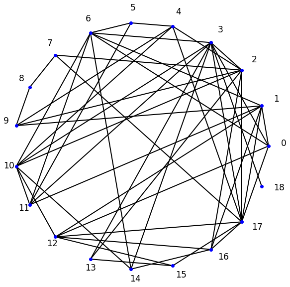
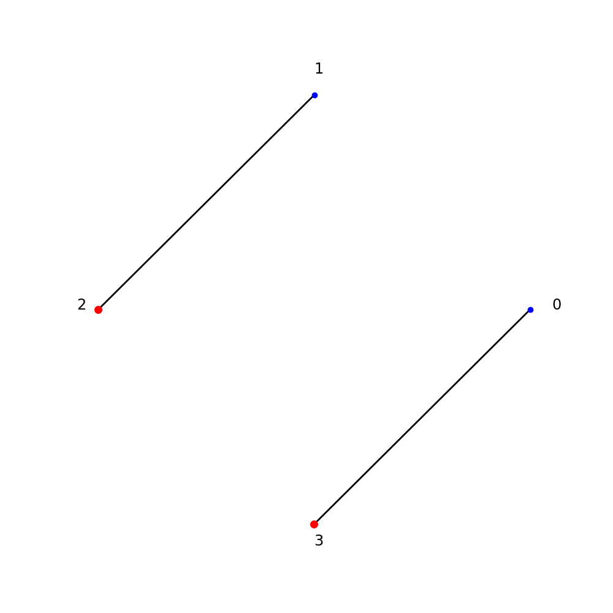
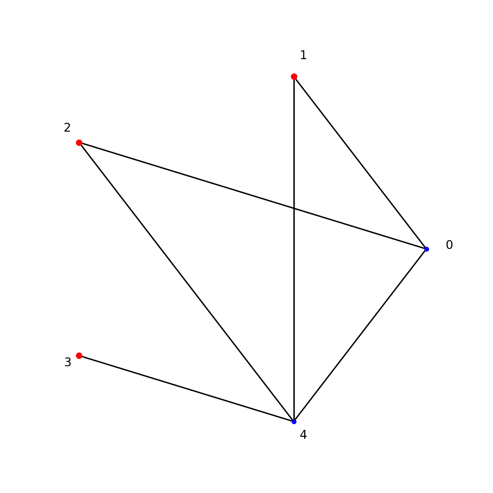
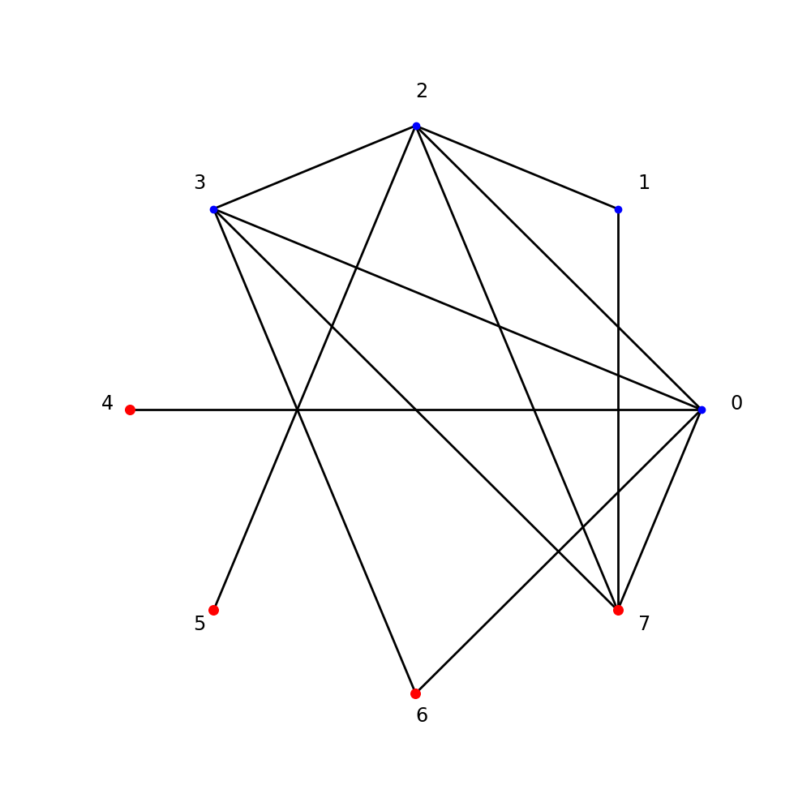
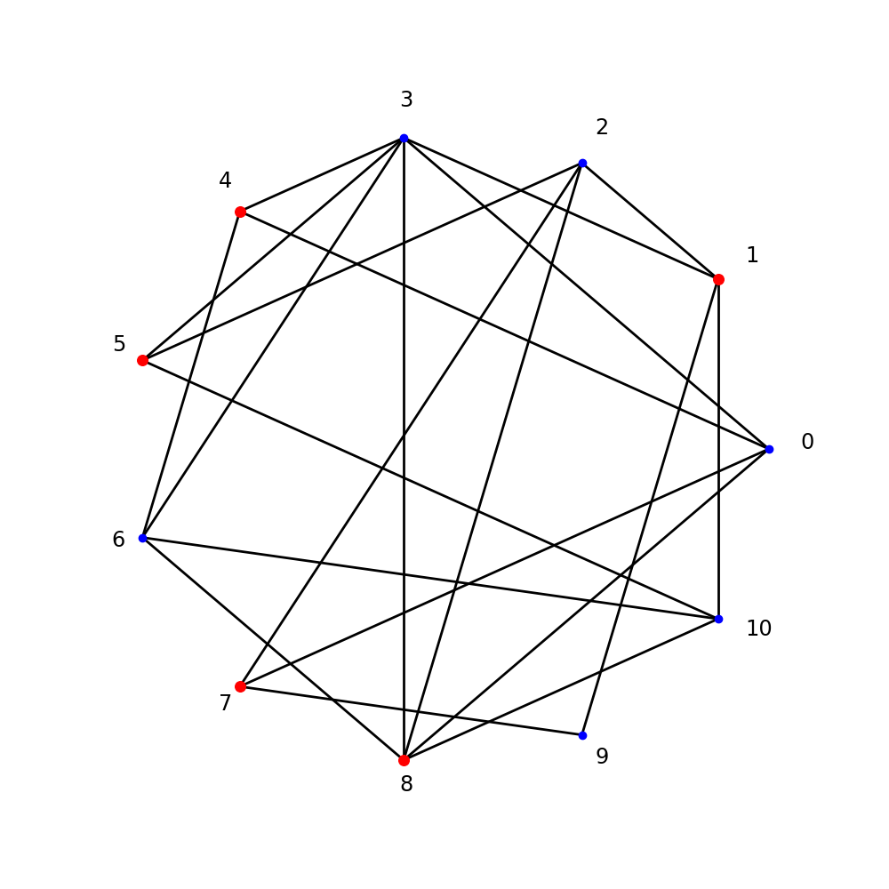
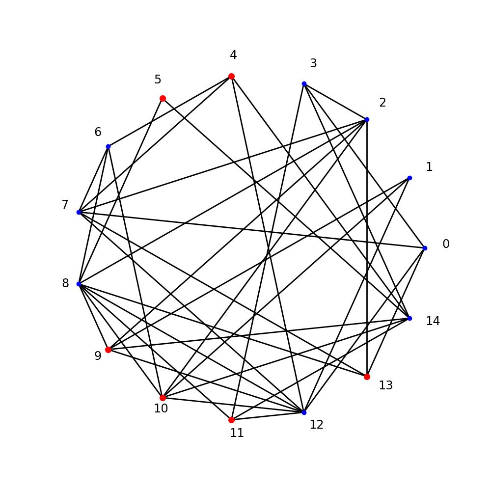
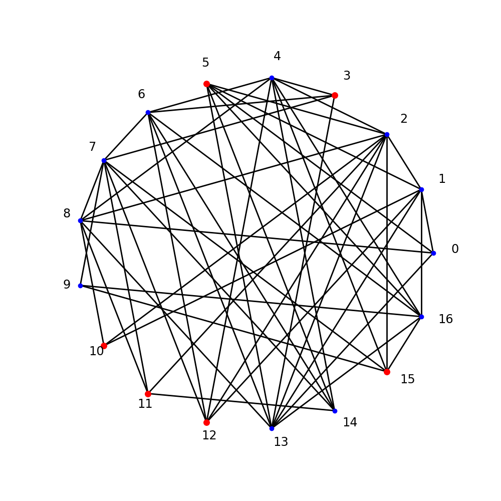

# Task 2

## Класс Graph

В модуле `graph.py` реализован класс, поддерживающий работу с графами. Инициализировать граф можно словарём, ключами которого являются целые последовательные вершины от 0 до N — вершины графа. Значение каждого ключа — set с вершинами, соседними к данной. Пример корректной инициализации графа:

```
G = Graph({0: {1},
 1: {0, 2},
 2: {1}})
```

Получить представление графа в виде словаря можно с помощью аттрибута `.graph`:

```
G.graph
```

Добавить новую вершину и ребро в граф можно с помощью методов `.add_node` и `.add_edge`:

```
G.add_node(3)
G.add_edge(4, 2)
```

Генерируем случайный граф:

```
G = Graph()
G.generate_random_graph(p=0.3)
```

Получаем такой граф:

```
{0: {1, 3, 6, 12, 17},
 1: {0, 6, 9, 11, 12, 16, 17},
 2: {3, 4, 7, 9, 10, 13, 16, 17},
 3: {0, 2, 6, 10, 11, 13, 14, 17, 18},
 4: {2, 5, 9, 10, 17},
 5: {4, 6, 11},
 6: {0, 1, 3, 5, 10, 11, 14},
 7: {2, 8, 17},
 8: {7, 9},
 9: {1, 2, 4, 8},
 10: {2, 3, 4, 6, 11, 12, 14},
 11: {1, 3, 5, 6, 10},
 12: {0, 1, 10, 15, 16, 17},
 13: {2, 3, 15},
 14: {3, 6, 10, 16},
 15: {12, 13, 17},
 16: {1, 2, 12, 14, 17},
 17: {0, 1, 2, 3, 4, 7, 12, 15, 16},
 18: {3}}
```

Отрисовываем этот граф:

```
G.plot_graph()
```




В классе реализованы также некоторые вспомогательные методы.

## Алгоритм поиска максимального независимого множества

В модуле `graph.py` так же реализован алгоритм поиска максимального независимого множества в функции `max_independent_set`.

Алгоритм:

1. Инициализируем `set`, в котором будем хранить вершины максимального независимого множества.
2. Перебираем все непустые подмножества вершин графа.
3. Для каждого подмножества проверяем, является ли оно независимым. Для этого проходим по всем вершинам множества и проверяем на пустоту пересечение соседей каждой вершины и текущего подмножества.
4. Если находим более большое подмножество, то обновляем `set`.

Резуьтат алгоритма на 6 случайных графах хранится в `algorithm_result/` в `.png` и `.txt`. В `.txt` сохранены также исходные случайные графы.

Вершины, входящие в максимальное независимое множество, выделены красным цветом:

4 nodes | 5 nodes 
:---:|:---:
 |  

8 nodes | 11 nodes
:---: | :---:
 | 

15 nodes | 17 nodes
:---:|:---:
 | 


